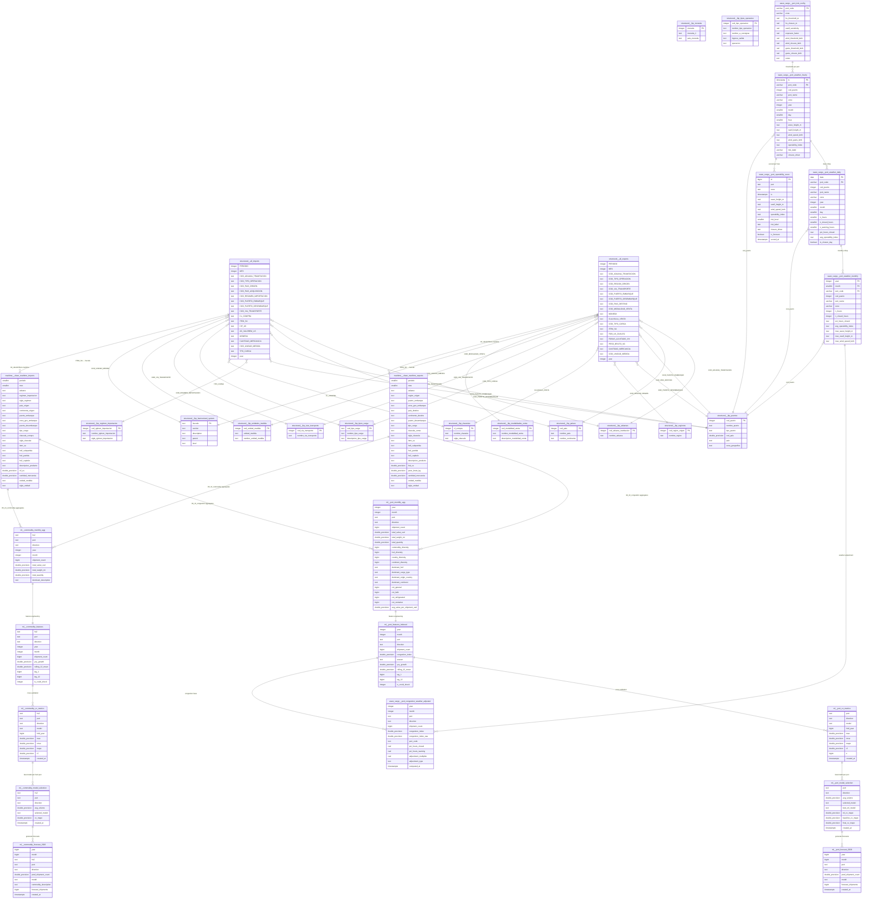

# WazeCargo — Entity Relationship Diagram (Mermaid)

```mermaid
erDiagram

    %% ════════════════════════════════════════════
    %%  STRUCTURED SCHEMA — Raw + Lookups
    %% ════════════════════════════════════════════

    structured__all_imports {
        integer PERIODO
        integer MES
        text COD_ADUANA_TRAMITACION
        text COD_TIPO_OPERACION
        text COD_PAIS_ORIGEN
        text COD_PAIS_ADQUISICION
        text COD_REGIMEN_IMPORTACION
        text COD_PUERTO_EMBARQUE
        text COD_PUERTO_DESEMBARQUE
        text COD_VIA_TRANSPORTE
        text CL_COMPRA
        text ITEM_SA
        text CIF_US
        text AD_VALOREM_US
        text MONEDA
        text CANTIDAD_MERCANCIA
        text COD_UNIDAD_MEDIDA
        text TPO_CARGA
        integer year
    }

    structured__all_exports {
        integer PERIODO
        integer MES
        text COD_ADUANA_TRAMITACION
        text COD_TIPO_OPERACION
        text COD_REGION_ORIGEN
        text COD_VIA_TRANSPORTE
        text COD_PUERTO_EMBARQUE
        text COD_PUERTO_DESEMBARQUE
        text COD_PAIS_DESTINO
        text COD_MODALIDAD_VENTA
        text MONEDA
        text CLAUSULA_VENTA
        text COD_TIPO_CARGA
        text ITEM_SA
        text FOB_US_DUSLEG
        text FOBUS_AJUSTADO_IVV
        text PESO_BRUTO_KG
        text CANTIDAD_MERCANCIA
        text COD_UNIDAD_MEDIDA
        integer year
    }

    structured__lkp_aduanas {
        integer cod_aduana_tramitacion PK
        text nombre_aduana
    }

    structured__lkp_clausulas {
        integer cl_compra PK
        text nombre_clausula
        text sigla_clausula
    }

    structured__lkp_harmonized_system {
        text hscode PK
        text section
        text description
        text parent
        text level
    }

    structured__lkp_modalidades_venta {
        integer cod_modalidad_venta PK
        text nombre_modalidad_venta
        text descripcion_modalidad_venta
    }

    structured__lkp_moneda {
        integer moneda PK
        text moneda_1
        text pais_moneda
    }

    structured__lkp_paises {
        integer cod_pais PK
        text nombre_pais
        text nombre_continente
    }

    structured__lkp_puertos {
        integer cod_puerto PK
        text nombre_puerto
        text tipo_puerto
        double_precision cod_pais
        text pais
        text zona_geografica
    }

    structured__lkp_regimen_importacion {
        integer cod_rgimen_importacion PK
        text nombre_rgimen_importacion
        text sigla_rgimen_importacion
    }

    structured__lkp_regiones {
        integer cod_region_origen PK
        text nombre_region
    }

    structured__lkp_tipos_carga {
        text cod_tipo_carga PK
        text nombre_tipo_carga
        text descripcion_tipo_carga
    }

    structured__lkp_tipos_operacion {
        integer cod_tipo_operacion PK
        text nombre_tipo_operacion
        text nombre_a_consignar
        text ingreso_salida
        text operacion
    }

    structured__lkp_unidades_medida {
        integer cod_unidad_medida PK
        text unidad_medida
        text nombre_unidad_medida
    }

    structured__lkp_vias_transporte {
        integer cod_via_transporte PK
        text nombre_via_transporte
    }

    %% Lookup relationships — IMPORTS
    structured__all_imports }o--|| structured__lkp_aduanas : "COD_ADUANA_TRAMITACION"
    structured__all_imports }o--|| structured__lkp_paises : "COD_PAIS_ORIGEN"
    structured__all_imports }o--|| structured__lkp_puertos : "COD_PUERTO_EMBARQUE"
    structured__all_imports }o--|| structured__lkp_puertos : "COD_PUERTO_DESEMBARQUE"
    structured__all_imports }o--|| structured__lkp_regimen_importacion : "COD_REGIMEN_IMPORTACION"
    structured__all_imports }o--|| structured__lkp_clausulas : "CL_COMPRA"
    structured__all_imports }o--|| structured__lkp_tipos_carga : "TPO_CARGA"
    structured__all_imports }o--|| structured__lkp_vias_transporte : "COD_VIA_TRANSPORTE"
    structured__all_imports }o--|| structured__lkp_unidades_medida : "COD_UNIDAD_MEDIDA"
    structured__all_imports }o--|| structured__lkp_harmonized_system : "ITEM_SA → hscode"

    %% Lookup relationships — EXPORTS
    structured__all_exports }o--|| structured__lkp_aduanas : "COD_ADUANA_TRAMITACION"
    structured__all_exports }o--|| structured__lkp_paises : "COD_PAIS_DESTINO"
    structured__all_exports }o--|| structured__lkp_puertos : "COD_PUERTO_EMBARQUE"
    structured__all_exports }o--|| structured__lkp_puertos : "COD_PUERTO_DESEMBARQUE"
    structured__all_exports }o--|| structured__lkp_regiones : "COD_REGION_ORIGEN"
    structured__all_exports }o--|| structured__lkp_clausulas : "CLAUSULA_VENTA"
    structured__all_exports }o--|| structured__lkp_tipos_carga : "COD_TIPO_CARGA"
    structured__all_exports }o--|| structured__lkp_vias_transporte : "COD_VIA_TRANSPORTE"
    structured__all_exports }o--|| structured__lkp_unidades_medida : "COD_UNIDAD_MEDIDA"
    structured__all_exports }o--|| structured__lkp_modalidades_venta : "COD_MODALIDAD_VENTA"
    structured__all_exports }o--|| structured__lkp_harmonized_system : "ITEM_SA → hscode"

    %% ════════════════════════════════════════════
    %%  MARITIME SCHEMA — Clean (filtered maritime only)
    %% ════════════════════════════════════════════

    maritime__clean_maritime_imports {
        smallint periodo
        smallint mes
        text aduana
        text regimen_importacion
        text sigla_regimen
        text pais_origen
        text continente_origen
        text puerto_embarque
        text zona_geo_embarque
        text puerto_desembarque
        text tipo_carga
        text clausula_compra
        text sigla_clausula
        text item_sa
        text hs6_subpartida
        text hs4_partida
        text hs2_capitulo
        text descripcion_producto
        double_precision cif_us
        double_precision cantidad_mercancia
        text unidad_medida
        text sigla_unidad
    }

    maritime__clean_maritime_exports {
        smallint periodo
        smallint mes
        text aduana
        text region_origen
        text puerto_embarque
        text zona_geo_embarque
        text pais_destino
        text continente_destino
        text puerto_desembarque
        text tipo_carga
        text clausula_venta
        text sigla_clausula
        text item_sa
        text hs6_subpartida
        text hs4_partida
        text hs2_capitulo
        text descripcion_producto
        double_precision fob_us
        double_precision peso_bruto_kg
        double_precision cantidad_mercancia
        text unidad_medida
        text sigla_unidad
    }

    %% Built from structured
    structured__all_imports ||--o{ maritime__clean_maritime_imports : "03_rebuild filters maritime"
    structured__all_exports ||--o{ maritime__clean_maritime_exports : "03_rebuild filters maritime"

    %% ════════════════════════════════════════════
    %%  ML SCHEMA — Port Congestion
    %% ════════════════════════════════════════════

    ml__port_monthly_agg {
        integer year
        integer month
        text port
        text direction
        bigint shipment_count
        double_precision total_value_usd
        double_precision total_weight_mt
        double_precision total_quantity
        bigint commodity_diversity
        bigint hs4_diversity
        bigint country_diversity
        bigint continent_diversity
        text dominant_hs2
        text dominant_cargo_type
        text dominant_origin_country
        text dominant_continent
        bigint cnt_general
        bigint cnt_bulk
        bigint cnt_refrigerated
        bigint cnt_container
        double_precision avg_value_per_shipment_usd
    }

    ml__port_features_indexed {
        integer year
        integer month
        text port
        text direction
        bigint shipment_count
        double_precision congestion_index
        text season
        double_precision yoy_growth
        double_precision rolling_12_mean
        bigint lag_1
        bigint lag_12
        integer is_covid_shock
    }

    ml__port_cv_metrics {
        text port
        text direction
        text model
        bigint fold_year
        double_precision mae
        double_precision rmse
        double_precision mape
        double_precision r2
        bigint n
        timestamptz created_at
    }

    ml__port_model_selection {
        text port
        text direction
        double_precision avg_volume
        text selected_model
        text best_ml_model
        double_precision ml_cv_mape
        double_precision baseline_cv_mape
        double_precision final_cv_mape
        timestamptz created_at
    }

    ml__port_forecast_2026 {
        bigint year
        bigint month
        text port
        text direction
        double_precision pred_shipment_count
        text model
        bigint forecast_shipments
        timestamptz created_at
    }

    %% Port ML data flow
    maritime__clean_maritime_imports ||--o{ ml__port_monthly_agg : "04_ml_congestion aggregates"
    maritime__clean_maritime_exports ||--o{ ml__port_monthly_agg : "04_ml_congestion aggregates"
    ml__port_monthly_agg ||--|| ml__port_features_indexed : "feature engineering"
    ml__port_features_indexed ||--o{ ml__port_cv_metrics : "cross-validation"
    ml__port_cv_metrics ||--o{ ml__port_model_selection : "best model per port"
    ml__port_model_selection ||--o{ ml__port_forecast_2026 : "generate forecasts"

    %% ════════════════════════════════════════════
    %%  ML SCHEMA — Commodity
    %% ════════════════════════════════════════════

    ml__commodity_monthly_agg {
        text hs2
        text port
        text direction
        integer year
        integer month
        bigint shipment_count
        double_precision total_value_usd
        double_precision total_weight_mt
        double_precision total_quantity
        text dominant_description
    }

    ml__commodity_features {
        text hs2
        text port
        text direction
        integer year
        integer month
        bigint shipment_count
        double_precision yoy_growth
        double_precision rolling_12_mean
        bigint lag_1
        bigint lag_12
        integer is_covid_shock
    }

    ml__commodity_cv_metrics {
        text hs2
        text port
        text direction
        text model
        bigint fold_year
        double_precision mae
        double_precision rmse
        double_precision mape
        double_precision r2
        timestamptz created_at
    }

    ml__commodity_model_selection {
        text hs2
        text port
        text direction
        double_precision avg_volume
        text selected_model
        double_precision cv_mape
        timestamptz created_at
    }

    ml__commodity_forecast_2026 {
        bigint year
        bigint month
        text hs2
        text port
        text direction
        double_precision pred_shipment_count
        text model
        text commodity_description
        bigint forecast_shipments
        timestamptz created_at
    }

    %% Commodity ML data flow
    maritime__clean_maritime_imports ||--o{ ml__commodity_monthly_agg : "05_ml_commodity aggregates"
    maritime__clean_maritime_exports ||--o{ ml__commodity_monthly_agg : "05_ml_commodity aggregates"
    ml__commodity_monthly_agg ||--|| ml__commodity_features : "feature engineering"
    ml__commodity_features ||--o{ ml__commodity_cv_metrics : "cross-validation"
    ml__commodity_cv_metrics ||--o{ ml__commodity_model_selection : "best model per hs2+port"
    ml__commodity_model_selection ||--o{ ml__commodity_forecast_2026 : "generate forecasts"

    %% ════════════════════════════════════════════
    %%  WAZE_CARGO SCHEMA — Weather & Operability
    %% ════════════════════════════════════════════

    waze_cargo__port_risk_config {
        varchar port_code PK
        varchar zone
        real hs_threshold_m
        real hs_closure_m
        real swell_sensitivity
        real exposure_factor
        real wind_threshold_kmh
        real wind_closure_kmh
        real gusts_threshold_kmh
        real gusts_closure_kmh
        text notes
    }

    waze_cargo__port_weather_hourly {
        timestamp ts PK
        varchar port_code PK
        integer cod_puerto
        varchar port_name
        varchar zone
        integer year
        smallint month
        smallint day
        smallint hour
        real wave_height_m
        real swell_height_m
        real wind_speed_kmh
        real wind_gusts_kmh
        real operability_index
        varchar risk_label
        varchar closure_driver
    }

    waze_cargo__port_weather_daily {
        date date PK
        varchar port_code PK
        integer cod_puerto
        varchar port_name
        varchar zone
        integer year
        smallint month
        smallint day
        smallint n_hours
        smallint n_closed_hours
        smallint n_warning_hours
        real pct_hours_closed
        real avg_operability_index
        boolean is_closure_day
    }

    waze_cargo__port_weather_monthly {
        integer year PK
        smallint month PK
        varchar port_code PK
        integer cod_puerto
        varchar port_name
        varchar zone
        integer n_hours
        integer n_closed_hours
        real pct_hours_closed
        real avg_operability_index
        real max_wave_height_m
        real max_swell_height_m
        real max_wind_speed_kmh
    }

    waze_cargo__port_operability_score {
        bigint id PK
        text port
        text zone
        timestamptz ts
        real wave_height_m
        real swell_height_m
        real wind_speed_kmh
        real operability_index
        smallint risk_level
        text risk_label
        text closure_driver
        boolean is_forecast
        timestamptz scored_at
    }

    waze_cargo__port_congestion_weather_adjusted {
        integer year
        integer month
        text port
        text direction
        bigint shipment_count
        double_precision congestion_index
        double_precision congestion_index_raw
        text port_code
        real pct_hours_closed
        real pct_hours_warning
        real adjustment_multiplier
        text adjustment_type
        timestamptz computed_at
    }

    %% Weather data flow
    waze_cargo__port_risk_config ||--o{ waze_cargo__port_weather_hourly : "thresholds per port"
    waze_cargo__port_weather_hourly ||--o{ waze_cargo__port_weather_daily : "daily rollup"
    waze_cargo__port_weather_daily ||--o{ waze_cargo__port_weather_monthly : "monthly rollup"
    waze_cargo__port_weather_hourly ||--o{ waze_cargo__port_operability_score : "scored per hour"

    %% Weather adjusts congestion
    ml__port_features_indexed ||--o{ waze_cargo__port_congestion_weather_adjusted : "congestion base"
    waze_cargo__port_weather_monthly ||--o{ waze_cargo__port_congestion_weather_adjusted : "weather adjustment"

    %% Port code linkage
    waze_cargo__port_weather_hourly }o--|| structured__lkp_puertos : "cod_puerto"
    waze_cargo__port_weather_daily }o--|| structured__lkp_puertos : "cod_puerto"
    waze_cargo__port_weather_monthly }o--|| structured__lkp_puertos : "cod_puerto"
```
